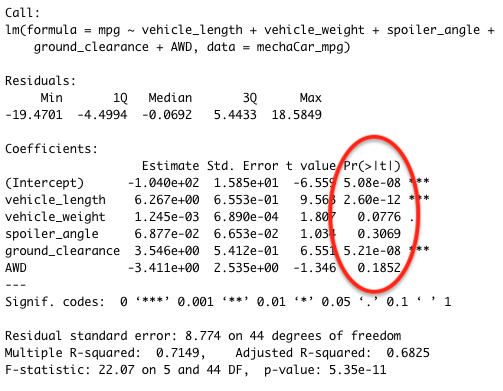
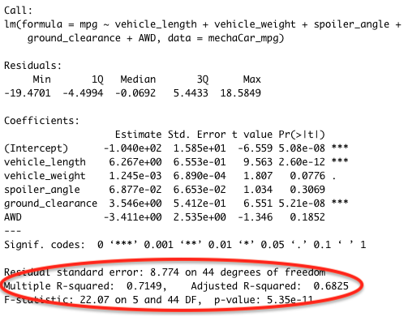
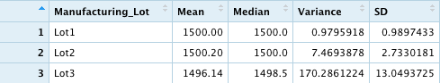
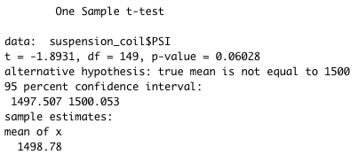
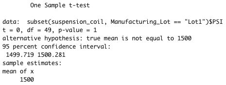
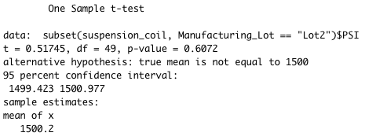
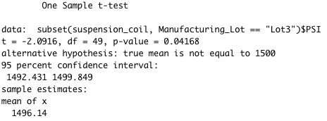

# MechaCar Statistical Analysis

In this project we analyzed two sets of data for our client Jeremy who needs us to analyze the production data for insights that may help the manufacturing team pertaining to AutosRUs' newest prototype, the MechaCar. We used R to perform analysis to run multiple linear regression, collect summary statistics, run t-tests, and finally we designed a study to compare vehicle performance of the MechaCar against vehicles from other manufacturers. We also answered specific questions pertaining to each analysis we ran located below.

## Linear Regression to Predict MPG

### Which variables/coefficients provided a non-random amount of variance to the mpg values in the dataset?

Variables that have p values very close to 0 provide a non-random amount of variance. The two variables that had very small p values were vehicle length with a p value of 2.60e-12 and ground clearnance with a p value of 5.21e-08. Since the p values for these two variables were so small, we can conclude that they provide a non-random amount of variance to the mpg values. The p-values for this dataset can be seen in the red circle in the screenshot above.

### Is the slope of the linear model considered to be zero? Why or why not?

The slope of this linear model would not be zero because there are two dependent variables, vehicle length and ground clearance, that are not determined by random chance or error because their p values are close to 0. Any linear model that had dependent variables that are not determined by random chance will produce a slope not equal to 0. Inversely, a linear model that has no significat linear relationship in which all dependent variables would be determined by random chance or error would have a slope of 0.

### Does this linear model predict mpg of MechaCar prototypes effectively? Why or why not?

This linear model does well to predict mpg of MechaCar prototypes because it has an R-squared of .7149 and an adjusted R-squared of .6825 although it is no where near perfect. R-squared ranges between 0 and 1 and is the coeffcient of determination and represents how well the model approximated real-world data points. The higher the R-squared, the more likely the linear model will predct future data points. Adjusted R-squared is R-squared that has been adjusted for the number of predictors in the model since each predictor that is added to the model will always increase R-Squared. We can use adjusted R-squared as our main indicator since there are multiple predictors in this model. Adjusted R-Squared is .6825 meaning we can predict future data points with 68% certainty. The R-Squared and Adujusted R-Squared can be seen in the red circle in the screenshot above.

## Summary Statistics on Suspension Coils

### The design specifications for the MechaCar suspension coils dictate that the variance of the suspension coils must not exceed 100 pounds per square inch. Does the current manufacturing data meet this design specification for all manufacturing lots in total and each lot individually? Why or why not?

The variance for all the manufacturing lots in total is 62.29 which does not exceed the 100 pounds per square inch required for the design specifications. This variance can be seen in the first screenshot above. The data indicates that the suspension coil manufacturing in total does pass, but when we break the lots down individually we do see that one lot fails manufacturing protocols. The variance for lot 1 is .97, the variance for lot 2 is 7.46 and the variance for lot 3 is 170.29. This variance can be seen in the second screenshot above. This data shows that the variance is lot 3 is much greater than the less than 100 that is required. We reccomend that suspension coil manufacturing cointinue in lots 1 and 2 but cease in lot 3 until the variance can be fixed.

## T-Tests on Suspension Coils

### Briefly summarize your interpretation and findings for the t-test results

We ran t-tests accross the total of the three manufacturing lots and then each individual manufacturing lot to determine whether the PSI accross the manufacturing lots were statistically different from the population mean of 1,500 PSI. When looking at the t-test for the total of all lots, the p-value was .060 which is higher than the common significance level of .05. This mean that there is not enough evidence to reject the null hypothesis. The total t-test is located in the screenshot above.

When we look at lot 1, we see that the p-value is 1. Because it is higher than the common significance of .05, we cannot reject the null hypothesis that there is no statistical difference between the observed mean and the hypothesized mean of 1500. The lot 1 t-test is located in the screenshot above.

The same goes for lot 2, which as p-value of .607. Since this is higher than the common significance of .05, we again cannot reject the null hyptothesis. The lot 2 t-test is located in the screenshot above.

But when we look at lot 3, we see that the p-value is .0416. This value is less than the common significance of .05. This indicated that we can reject the null hypothesis that the sample mean and hypothesized mean are not statistically different. The lot 3 t-test is located in the screenshot above.

## Study Design: MechaCar vs Competition

In this section I will be creating a statistical study that can quantify how the MechaCar performs against the competition. I will be testing to see if the price for the MechaCar is appropriate in comparison to the competion.

### What metric or metrics are you going to test?

Price (Dependent Variable)
MPG (Independent Variable)
Horse Power (Independent Variable)
Maintenance Cost (Independent Variable)
Safety Rating (Independent Variable)

### What is the null hypothesis or alternative hypothesis?

My null hypothesis for this study is that the MechaCar is priced correctly in comparison to the competition based on the performance of the previously stated metrics.

### What statistical test would you use to test the hypothesis? And why?

I will use a multiple linear regression to test my hypothesis. Multiple linear regression is uses multiple independent variables to account for parts of the total variance oberved in the dependent variable.

### What data is needed to run the statistical test?

I would need price, mpg, horse power, maintenance cost, and safety rating for the MechaCar along with at least 10 other other car models. Ideally we run this test with closer to 50 different models to provide a more accurate analysis and reduce the impact of outliers.